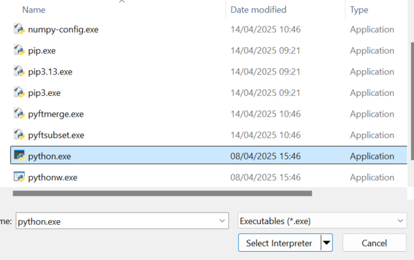

## Introduction

The basic setup for the python tutorials would be built around [VS Code](https://code.visualstudio.com/), a freely available integrated development environment. 

Please try out the following instructions once, but don't panic if something doesn't work out (especially if step 5 seems too complex), we should be able to quickly fix any issues during the tutorials!

## Instructions for installation and setup 

1. Download and install the latest python release for [Windows from here](https://www.python.org/ftp/python/3.13.3/python-3.13.3-amd64.exe) and for [Mac OS from here](https://www.python.org/ftp/python/3.13.3/python-3.13.3-macos11.pkg). If you use linux, it already comes with python.\
Note: The above links should work on most computers. However, if they don't you can find a list of all installers [here](https://www.python.org/downloads/release/python-3133/).

2. Download and install VS Code for your operating system from [here](https://code.visualstudio.com/Download).\
Tip: The [homepage](https://code.visualstudio.com) automatically detects the OS you're currently using and suggests a download.

3. The next step is specific to your operating system.

    * On **Windows**, open **Command Prompt** (type cmd on the start menu), copy paste the following lines into it, and hit enter.
        ```
        py -m venv %USERPROFILE%\pyenv_empra
        %USERPROFILE%\pyenv_empra\Scripts\Activate
        py -m pip install numpy matplotlib scipy pandas 
        ```

        Wait till all the packages finish installing.

    * On **Mac OS/Linux**, open a **Terminal**, copy paste the following lines into it, and hit enter.

        ```
        python3 -m venv ~/pyenv_empra
        source ~/pyenv_empra/bin/activate
        python3 -m pip install numpy matplotlib scipy pandas 
        ```
        Wait till all the packages finish installing.

 4. Open **VS Code** and go to **File > Preferences > Extensions**. Search for "Python" and click on install for the first extension that shows up on the list. Next, search for "Jupyter" and again click on install for the first extension on the list. You do not need to click on any options that VS Code presents you with after installing the extensions.

5. The following are the final steps to link VS Code to the python setup. 

    * In VS Code, press **Cltr+Shift+P** and type "python:select interpreter"
    

    * Select the option and then select "Enter interpreter path"
    

    * Depending on your OS,
        
        * On **Windows** click on **Find...** and then navigate to and select the python.exe file as shown below.
        \
        \
        Double click on **pyenv_empra**
        \
        \
        Double click on **Scripts**
        \
        \
        Double click on **python.exe**
        

        * On **Linux/Mac OS**, simply paste the following line and hit enter.
            ```
            ~/pyenv_empra/bin/activate
            ```
6. For a quick check if things have gone well so far, download "test.py" from this repository, open it on VS Code, and run it by clicking on the run icon (first icon on the top right corner on the same row where you see the filename).

    
    
If it runs through and prints "All is well", then **that's all!**. We should be able to run python files on VS Code now!